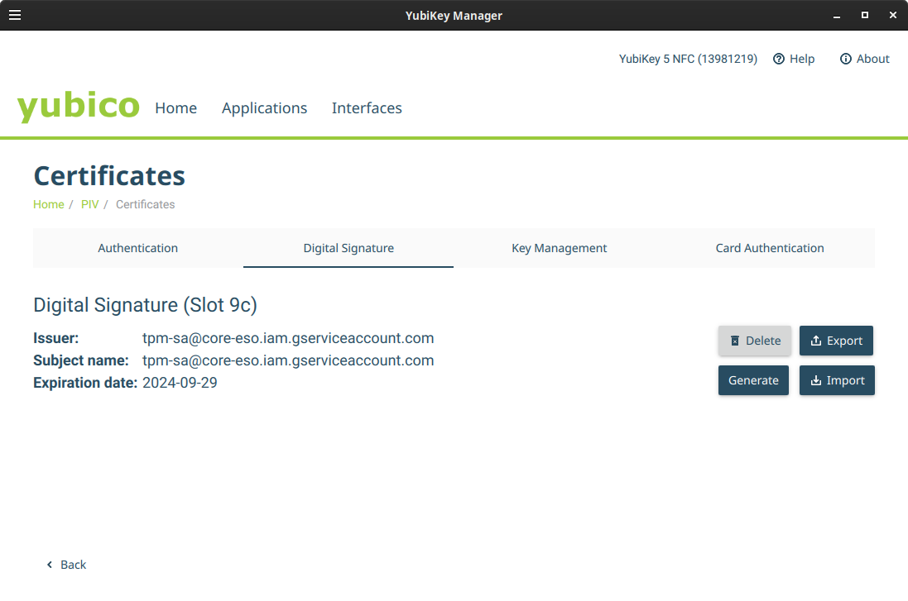

### PKCS-11 Credential Source for Google Cloud SDK

Binary that just returns a Service Accounts `access_token` for use with GCP Credential Libraries where the key is accessed using `PKCS-11`.

While not running on a GCP platform like GCE, Cloud Run, GCF or GKE, `Service Account` authentication usually (with exception of workload federation) requires direct access to its RSA Private key.. 

You can see why here in the protocol itself: [Using OAuth 2.0 for Server to Server Applications](https://developers.google.com/identity/protocols/oauth2/service-account#authorizingrequests).  Basically service account authentication involves locally signing a JWT using a registered private key and then exchanging the JWT for an `access_token`.

What this repo offers is a way to generate the JWT while the RSA key is embedded on a `PKCS-11` aware device like an `HSM`, `TPM` or even a `Yubikey`.

(you can also import an external RSA to a device to the same effect but its more secure to have an unexportable key that'll never leave hardware).

The setup below shows how to use RSA keys on the device  to mint an x509 using `openssl` and then [upload that key to GCP](https://cloud.google.com/iam/docs/keys-upload#uploading) for binding to a service account.  Note that GCP service accounts can have [at most 10 keys](https://cloud.google.com/iam/quotas) associated with it.  This repo uses up one of those slots.  Sometimes you can "import" an RSA into an HSM but thats not covered here.

I'm not going into the background of what [PKCS-11](https://en.wikipedia.org/wiki/PKCS_11) is but will state that its pretty particular in its setup.

For reference, some of the providers and enablement technology stack this repo covers

* OpenSSL Provider
  - `/usr/lib/x86_64-linux-gnu/engines-1.1/libpkcs11.so`:  OpenSSL Engine that allows dynamic PKCS11 providers

* PKCS11 Modules
  - `/usr/lib/x86_64-linux-gnu/softhsm/libsofthsm2.so`: [SoftHSM PKCS Driver](https://packages.ubuntu.com/xenial/libsofthsm2)
  - `/usr/lib/x86_64-linux-gnu/libtpm2_pkcs11.so.1`: [TPM PKCS11 Driver](https://github.com/tpm2-software/tpm2-pkcs11)
  - `/usr/local/lib/libykcs11.so`:  [Yubikey PKCS Driver](https://developers.yubico.com/yubico-piv-tool/YKCS11/)

and other references/reps for PKCS-11

* [PKCS 11 Samples in Go using SoftHSM](https://github.com/salrashid123/go_pkcs11)
* [mTLS with PKCS11](https://github.com/salrashid123/mtls_pkcs11)
* [PKCS with TPMs](https://github.com/salrashid123/tpm2/tree/master/pkcs11)
* [golang-jwt for PKCS11](https://github.com/salrashid123/golang-jwt-pkcs11)
* [TPM Credential Source for Google Cloud SDK](https://github.com/salrashid123/gcp-adc-tpm)

>> this repo is NOT supported by google

---

The following shows how to setup and use three different PKCS backend to host GCP Service Account and the binary which returns the `access_token``.


The binaries provided here just returns  a JSON formatted [oauth2.Token](https://pkg.go.dev/golang.org/x/oauth2@v0.12.0#Token) which you can use in any GCP Library.

For example,

```golang
	sts := oauth2.StaticTokenSource(tok)
	storageClient, err := storage.NewClient(ctx, option.WithTokenSource(sts))
```

You can also invoke this binary as a full TokenSource as well:  see

* `golang`: [https://github.com/salrashid123/gcp_process_credentials_go](https://github.com/salrashid123/gcp_process_credentials_go)
* `python`: [https://github.com/salrashid123/gcp_process_credentials_py](https://github.com/salrashid123/gcp_process_credentials_py)
* `java`: [https://github.com/salrashid123/gcp_process_credentials_java](https://github.com/salrashid123/gcp_process_credentials_java)
* `node`: [https://github.com/salrashid123/gcp_process_credentials_node](https://github.com/salrashid123/gcp_process_credentials_node)

---


### Setup

For several samples below, we will use openssl to issue certificates which we will [upload](https://cloud.google.com/iam/docs/keys-upload#uploading).


First thing is to install `OpenSSL PKCS#11 engine`

```bash
apt-get install -y libengine-pkcs11-openssl
```

Which should be at `/usr/lib/x86_64-linux-gnu/engines-3/libpkcs11.so` depending on your version of openssl

Then edit `/etc/ssl/openssl.cnf` and specify the following at the top

```conf
openssl_conf = openssl_init

[openssl_init]
engines = engine_section

[engine_section]
pkcs11 = pkcs11_section

[pkcs11_section]
engine_id = pkcs11
dynamic_path = /usr/lib/x86_64-linux-gnu/engines-3/libpkcs11.so
# MODULE_PATH = /usr/lib/x86_64-linux-gnu/softhsm/libsofthsm2.so
# MODULE_PATH = /usr/lib/x86_64-linux-gnu/libtpm2_pkcs11.so.1 
init = 0
```

I've levt the `MODULE_PATH` commented out for now but you will need to set those depending on which backend you're using.


### SoftHSM

[SoftHSM](https://www.opendnssec.org/softhsm/) is used for testing so needless to say, its just for local stuff.

If you just want to test this, you need to [install SoftHSM](https://wiki.opendnssec.org/display/SoftHSMDOCS/SoftHSM+Documentation+v2#SoftHSMDocumentationv2-Download) ofcourse and ensure the driver is present at `/usr/lib/x86_64-linux-gnu/softhsm/libsofthsm2.so`. Remember to uncomment the openssl.cnf MODULE_PATH line.

From there, you'll create a file called `softhsm.conf`

- `cat /path/to/softhsm.conf`

```conf
log.level = DEBUG
objectstore.backend = file
directories.tokendir = /tmp/tokens
slots.removable = true
```


Now we're ready to initialize softhsm to hold a key

```bash
export PKCS_MODULE=/usr/lib/x86_64-linux-gnu/softhsm/libsofthsm2.so

## if you reboot, these are gone
mkdir /tmp/tokens
export SOFTHSM2_CONF=/path/to/softhsm.conf

# initialize the hsm
pkcs11-tool --module $PKCS_MODULE --slot-index=0 --init-token --label="token1" --so-pin="123456"
pkcs11-tool --module $PKCS_MODULE  --label="token1" --init-pin --so-pin "123456" --pin mynewpin
```

Now that we have the HSM initialized, we'll create an RSA key onboard

```bash
pkcs11-tool --module $PKCS_MODULE --label="keylabel1" --login  --pin=mynewpin --id 1  --keypairgen --key-type rsa:2048

## the list the slots, objects;  ofcourse your values will be different 
$ pkcs11-tool --module $PKCS_MODULE  --list-token-slots
        Available slots:
        Slot 0 (0x13c105de): SoftHSM slot ID 0x13c105de
        token label        : token1
        token manufacturer : SoftHSM project
        token model        : SoftHSM v2
        token flags        : login required, rng, token initialized, PIN initialized, other flags=0x20
        hardware version   : 2.6
        firmware version   : 2.6
        serial num         : 755a8d9713c105de
        pin min/max        : 4/255
        Slot 1 (0x1): SoftHSM slot ID 0x1
        token state:   uninitialized


$ pkcs11-tool --module $PKCS_MODULE  --list-objects --pin mynewpin
        Using slot 0 with a present token (0x13c105de)
        Public Key Object; RSA 2048 bits
        label:      keylabel1
        ID:         01
        Usage:      encrypt, verify, wrap
        Access:     local
        Private Key Object; RSA 
        label:      keylabel1
        ID:         01
        Usage:      decrypt, sign, unwrap
        Access:     sensitive, always sensitive, never extractable, local


## now create a PKCS URI that openssl understands
export PKCS11_URI="pkcs11:model=SoftHSM%20v2;manufacturer=SoftHSM%20project;serial=755a8d9713c105de;token=token1;object=keylabel1?pin-value=mynewpin"

## you can print out the public key
openssl rsa -engine pkcs11  -inform engine -in "$PKCS11_URI" -pubout

        -----BEGIN PUBLIC KEY-----
        MIIBIjANBgkqhkiG9w0BAQEFAAOCAQ8AMIIBCgKCAQEA0/BzOMZPMNhIhfbSM7on
        zA+XiQznZ5Qwlin6In4blYspPK4LluhOS3HR/wJW86xsCXT6DdKyM2cagldFxqEZ
        ogE+xuim0Y/lDfIFQlm0ovliNAn2qKf+ON/gTjByOJgnzwRJKh3Y5NseksV8iK7f
        56dSj6gfFcG6c/tbyTJJudgII5ZqFUqS0naoHyx+snhgLooeIu2aDVfbY6Ri3CiZ
        Q+7bCtA0QSkxD9+Nk3fU0I0KRo7wrozUvjQ041rXBBcrjySqepXJLPJoY2X1G81E
        sikaCFQYuHXxju6XRyHmeF2iq5/tdY0jWOWhkmZfv9qMyZFjSENRP4T8KnLEl+ug
        YwIDAQAB
        -----END PUBLIC KEY-----


## we can instruct openssl to use this embedded key to generate a certificate

openssl req -new -x509 -days 365 \
  -subj "/C=US/ST=CA/L=Mountain View/O=Google/OU=Enterprise/CN=pkcs-sa" \
   -sha256 -engine pkcs11 -keyform engine -key  "$PKCS11_URI"  -out cert_softhsm.pem
```

Now tht we have a certificate, we can upload this key and associate it with a service account

```bash
export PROJECT_ID=`gcloud config get-value core/project`

gcloud iam service-accounts create tpm-sa

gcloud iam service-accounts keys upload cert_softhsm.pem  --iam-account tpm-sa@$PROJECT_ID.iam.gserviceaccount.com

gcloud iam service-accounts keys list --iam-account=tpm-sa@$PROJECT_ID.iam.gserviceaccount.com
```

At this point we need to create a PKCS URL for that key.

Note for the URL, we're copying over the values for the PKCS Token and Object.  Specifically all the values we listed above (note that the slot-id value below is from hex->decimal: `0x13c105de --> 331417054`)

```bash
export FULL_PKCS11_URI="pkcs11:model=SoftHSM%20v2;manufacturer=SoftHSM%20project;slot-id=331417054;serial=755a8d9713c105de;token=token1;object=keylabel1;id=01?pin-value=mynewpin&module-path=/usr/lib/x86_64-linux-gnu/softhsm/libsofthsm2.so"

CGO_ENABLED=1 go build -o gcp-adc-pkcs adc.go

gcp-adc-pkcs --pkcsURI=$FULL_PKCS11_URI  --serviceAccountEmail=tpm-sa@$PROJECT_ID.iam.gserviceaccount.com

## output is json Token specs
{
  "access_token": "ya29.c.c0AY_VpZjqp...redacted",
  "expires_in": 3599,
  "token_type": "Bearer"
}
```


### TPM

If you want to generate an RSA key on a TPM, you'll first need to install some supporting libraries (critically `libtpm2-pkcs11-1`) and ofcourse a TPM (I used a GCP Shielded VM as an example so the TPM provider is `GOOG`)

```bash
apt-get update && apt-get install libtpm2-pkcs11-1 tpm2-tools libengine-pkcs11-openssl opensc  gnutls -y
```

You should verify `/usr/lib/x86_64-linux-gnu/libtpm2_pkcs11.so.1` is installed and lined.


As with SoftHSM, we will initialized the device and generate an RSA key onboard:


```bash
export PKCS_MODULE=/usr/lib/x86_64-linux-gnu/libtpm2_pkcs11.so.1 
pkcs11-tool --module $PKCS_MODULE --slot-index=0 --init-token --label="token1" --so-pin="123456"
pkcs11-tool --module $PKCS_MODULE  --label="token1" --init-pin --so-pin "123456" --pin mynewpin

## print out the (empty) slots and generate a key
pkcs11-tool --module $PKCS_MODULE --list-token-slots
pkcs11-tool --module $PKCS_MODULE --label="keylabel1" --login  --pin=mynewpin --id 1  --keypairgen --key-type rsa:2048


## after the  keys are generated:
$ pkcs11-tool --module $PKCS_MODULE --list-slots
    Available slots:
    Slot 0 (0x1): token1                          GOOG
      token label        : token1
      token manufacturer : GOOG
      token model        : vTPM
      token flags        : login required, rng, token initialized, PIN initialized
      hardware version   : 1.42
      firmware version   : 22.17
      serial num         : 0000000000000000
      pin min/max        : 0/128
    Slot 1 (0x2):                                 GOOG
      token state:   uninitialized


$ pkcs11-tool --module $PKCS_MODULE --list-objects  --pin mynewpin
    Using slot 0 with a present token (0x1)
    Public Key Object; RSA 2048 bits
      label:      keylabel1
      ID:         01
      Usage:      encrypt, verify
      Access:     local
    Private Key Object; RSA 
      label:      keylabel1
      ID:         01
      Usage:      decrypt, sign
      Access:     sensitive, always sensitive, never extractable, local
      Allowed mechanisms: RSA-X-509,RSA-PKCS-OAEP,RSA-PKCS,SHA1-RSA-PKCS,SHA256-RSA-PKCS,SHA384-RSA-PKCS,SHA512-RSA-PKCS,RSA-PKCS-PSS,SHA1-RSA-PKCS-PSS,SHA256-RSA-PKCS-PSS,SHA384-RSA-PKCS-PSS,SHA512-RSA-PKCS-PSS
```
now construct the PKCS URI that reflects the values you have:

```bash
export PKCS11_URI="pkcs11:model=vTPM;manufacturer=GOOG;serial=0000000000000000;token=token1;object=keylabel1;type=private?pin-value=mynewpin"

## then print out the public key, issue the cert
$ openssl rsa -engine pkcs11  -inform engine -in "$PKCS11_URI" -pubout
        engine "pkcs11" set.
        writing RSA key
        -----BEGIN PUBLIC KEY-----
        MIIBIjANBgkqhkiG9w0BAQEFAAOCAQ8AMIIBCgKCAQEA55HAxsbZyfPuBPPyLOqD
        A1hD9HygLAhAgkPVHa7BtpYPRNRA/YGiUg1ioJJlwKKgqk86fqndUi1FCIBqHcbW
        oGXJ1Bqtf/q6o8LGxAn6BwV0aLe0tDrOa0tU3VNV8A6uXiiaGBOmA49iT7iBaQtw
        sZp/JnpWJwZOrqdX4E4U0up72L/AYab4XvtWAytMPXy5W8rCWUOlKEojra864UN4
        E1ZxkxI3ywMNiLQe7XLilODbhGue5GP8XVXL4GD2zBFB4pipu4102245rgjZd0d5
        jB8kjyMKn6f/maj0qQDtZ0MrZKvjiuBVvzJR+Oj/8FL1CSJg0rl035yPzb6F2NTo
        lQIDAQAB
        -----END PUBLIC KEY-----

openssl req -new -x509 -days 365 \
  -subj "/C=US/ST=CA/L=Mountain View/O=Google/OU=Enterprise/CN=pkcs-sa" -sha256 \
   -engine pkcs11 -keyform engine -key  "$PKCS11_URI"  -out cert_tpm.pem
```


Now that we have the cert, we can upload it to GCP 
```bash
export PROJECT_ID=`gcloud config get-value core/project`

gcloud iam service-accounts create tpm-sa

gcloud iam service-accounts keys upload cert_tpm.pem  --iam-account tpm-sa@$PROJECT_ID.iam.gserviceaccount.com
gcloud iam service-accounts keys list --iam-account=tpm-sa@$PROJECT_ID.iam.gserviceaccount.com
```

Regenerate the URI in the canonical format for the binary and run
```bash
export FULL_PKCS11_URI="pkcs11:model=vTPM;manufacturer=GOOG;slot-id=01;serial=0000000000000000;token=token1;object=keylabel1;id=01?pin-value=mynewpin&module-path=/usr/lib/x86_64-linux-gnu/libtpm2_pkcs11.so.1"

go run adc.go --pkcsURI=$FULL_PKCS11_URI --serviceAccountEmail=tpm-sa@$PROJECT_ID.iam.gserviceaccount.com
```

Finally, you may want to restrict access to the TPM device by applying [tpm-udev.rules](https://github.com/salrashid123/tpm2#non-root-access-to-in-kernel-resource-manager-devtpmrm0-usint-tpm2-tss)

### YubiKey

(mostly copied from [here](https://github.com/salrashid123/golang-jwt-pkcs11#setup-yubikey))


For Yubikey, we wont' be using openssl to generate the cert but rather YubiKeys own UI to do all the work

First, you must have a [YubiKey Neo or YubiKey 4 or 5](https://developers.yubico.com/PIV/Introduction/YubiKey_and_PIV.html) as those the additional `PIV` support.

You are free to provision the key by any means but for reference, the following uses:

* [yubikey-manager-qt UI](https://developers.yubico.com/yubikey-manager-qt/development.html)
* [Yubico PIV Tool](https://github.com/Yubico/yubico-piv-tool)
* [yubico-piv-tool CLI](https://developers.yubico.com/yubico-piv-tool/)


Using the yubikey UI, click "Generate" a new self-signed rsa 2048 key.   Set the CN value to the service accounts CN for simplicity.

Export the key 



and assign that to the service account

```bash
export PROJECT_ID=`gcloud config get-value core/project`

gcloud iam service-accounts create tpm-sa

gcloud iam service-accounts keys upload cert_yubikey.pem  --iam-account tpm-sa@$PROJECT_ID.iam.gserviceaccount.com
gcloud iam service-accounts keys list --iam-account=tpm-sa@$PROJECT_ID.iam.gserviceaccount.com
```


From then on, any system where you need to access GCP from you must install

* [YKCS11](https://developers.yubico.com/yubico-piv-tool/YKCS11/)

so using `libykcs11.so`, find the specifications for your device

```bash
export PKCS_MODULE=/usr/local/lib/libykcs11.so

$  pkcs11-tool --module $PKCS_MODULE --list-token-slots
  Available slots:
  Slot 0 (0x0): Yubico YubiKey OTP+FIDO+CCID 00 00
    token label        : YubiKey PIV #13981219
    token manufacturer : Yubico (www.yubico.com)
    token model        : YubiKey YK5
    token flags        : login required, rng, token initialized, PIN initialized
    hardware version   : 1.0
    firmware version   : 5.27
    serial num         : 13981219
    pin min/max        : 6/48


$ pkcs11-tool --module $PKCS_MODULE --list-objects  --pin 123456

  Certificate Object; type = X.509 cert
    label:      X.509 Certificate for Digital Signature
    subject:    DN: CN=tpm-sa@core-eso.iam.gserviceaccount.com
    serial:     085F63F79A30D546FB522ADE8B98D1A307560A80
    ID:         02

  Public Key Object; RSA 2048 bits
    label:      Public key for Digital Signature
    ID:         02
    Usage:      encrypt, verify
    Access:     local
```

Then construct the URI using these values and execute the binary

```bash
export FULL_PKCS11_URI="pkcs11:model=YubiKey%20YK5;manufacturer=Yubico%20%28www.yubico.com%29;serial=13981219;slot-id=00;token=0;id=02;object=Private%20key%20for%20Digital%20Signature?pin-value=123456&module-path=/usr/local/lib/libykcs11.so"

go run adc.go --pkcsURI=$FULL_PKCS11_URI --serviceAccountEmail=tpm-sa@$PROJECT_ID.iam.gserviceaccount.com
```


---


#### Appendix


Note this sample uploads keys which can be blocked by the GCP Organization Policy  `constraints/iam.disableServiceAccountKeyUpload`.  


Finally you can also use `gnutls-bin`'s `p11tool` to inspect the URIs

```bash
p11tool --login --list-token-urls --detailed-url --provider=$PKCS_MODULE
p11tool --login --list-all-privkeys  --detailed-url --provider=$PKCS_MODULE
```